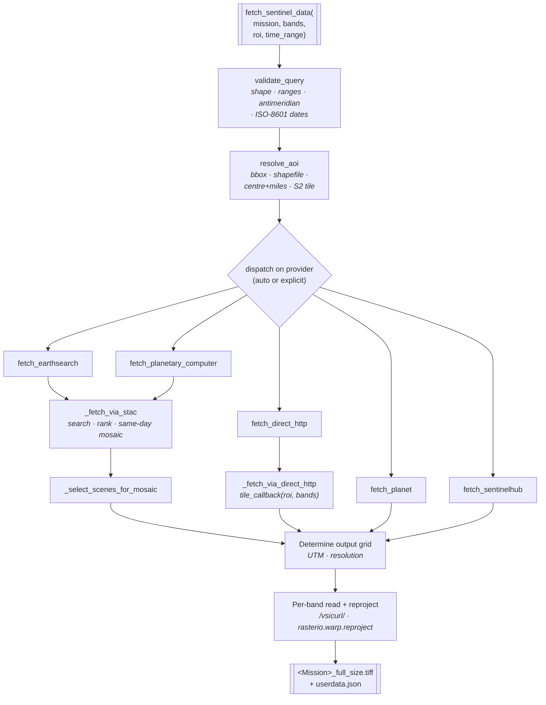
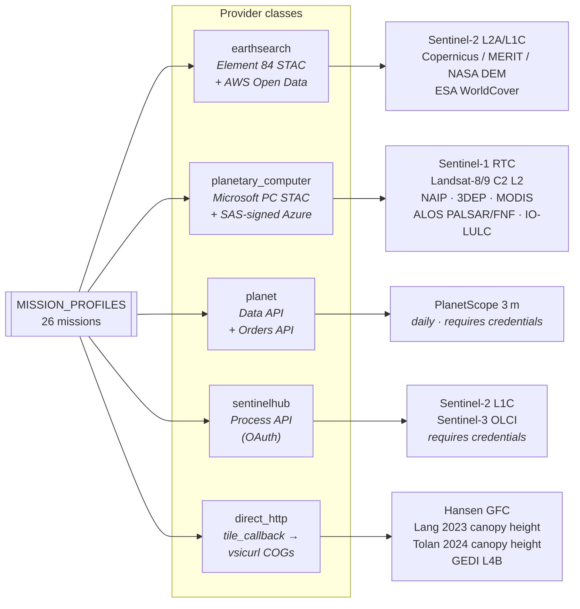

# Architecture

Two diagrams that map the pipeline end-to-end: how a `fetch_sentinel_data`
call routes through validation, provider dispatch, and the shared
post-fetch reproject-and-write stages; and which missions live on which
provider class.

## 1. Fetch pipeline

From user parameters to a georeferenced multi-band GeoTIFF. All five
provider classes converge on the same post-fetch stages
(determine output grid → per-band read + reproject → write
`<Mission>_full_size.tiff` + `userdata.json` sidecar), so downstream tools
never need to care which provider served the scene.

## 2. Provider architecture

`MISSION_PROFILES` (in `geoai_datacubes/fetch/missions.py`) is the single
source of truth for which provider a mission uses, which bands it exposes,
and how those bands map onto the provider's assets. `provider="auto"`
picks the recommended provider per mission; a user can override it at
call time.

See [`docs/data_layers.md`](data_layers.md) for the full 26-mission table
with per-mission bands, native resolution, value ranges, and provider
assignment. See [`docs/providers.md`](providers.md) for provider
trade-offs, credential setup, and per-provider rate-limit guidance.
